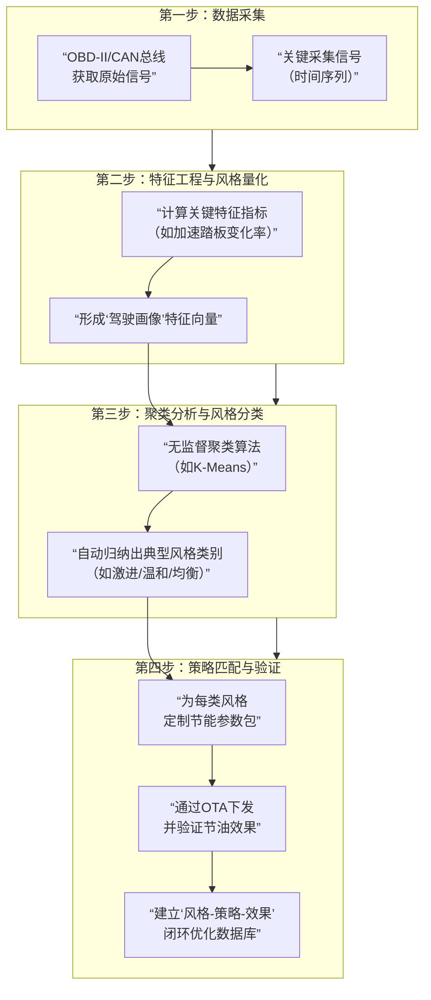

1. 首先进行数据的采集：

    通过车辆**OBD-II接口**（读取标准PID数据）（标准化的协议和物理接口）或**CAN总线**（一种用于车内设备通信的网络标准和硬件协议，定义了**电子控制单元**(ECU)之间如何交换数据。）（可以使用can总线分析仪进行），以高频率（如10Hz，适合驾驶行为的采样的频率）采集时序信号。

    1. 采集的核心信号：`车速`、`加速踏板开度`、`制动踏板状态`、`方向盘转角`、`电机输出扭矩/功率`、`瞬时能耗`。
    2. **片段信息**：单次行程的`行驶里程`、`时间`、`平均速度`。

2. 从采集的原始信号中**计算出一组能代表驾驶习惯的特征指标**：

    - **激进性指标**：

        - `平均/峰值加速踏板变化率`：踩油门有多“猛”。
        - `急加速次数`（如，加速度 > 2.5 m/s² 的次数/百公里）。
        - `电机功率输出波动率`。

        - **平稳性/预判性指标**：
            - `平均制动减速度`、`急减速次数`。
            - `滑行比例`（不踩油门和刹车的行驶时间占比）。
            - `能量回收贡献率`（回收能量占总消耗能量的比例）。

    - **行程特征指标**：
        - `平均车速`、`车速标准差`（波动大小）。
            - `拥堵路段比例`（车速 < 20 km/h的时间占比）。

    **输出**：每位司机（或每段行程）被转化为一个**特征向量**（特征工程），使用几个核心的量来定义驾驶的风格

3. 分类算法：将得到的数据贴上标签

    - 由于事先不知道有多少种风格，可以使用**无监督学习**的算法，比如：
        - K-Means聚类
        - 高斯混合模型

    **结果**：算法会自动将司机库分为 **N个簇**，每个簇代表一种典型的驾驶风格原型。

4. 通过上述的结果进行个性化策略库构建与匹配

    - **策略库**：为**每一类**驾驶风格原型，通过仿真或实车测试，调校出一套**最优节能参数包**。
        - **对“激进型”**：重点调校**加速踏板Map**，让前段输出更线性柔和，抑制不必要的急加速冲动。
        - **对“温和型”**：重点调校**能量回收强度Map**和**制动踏板关联曲线**，鼓励高效回收。

    - **匹配与OTA**：当系统判定一个新司机属于“A类”风格后，自动将“A类节能参数包”通过**OTA**推送至其车辆，完成底盘动力风格的个性化设置。

------

**展示的关键点**

1. **展示数据采集Demo**：用OBD设备 + 笔记本电脑，实时录制并显示一段驾驶的加速踏板曲线。
2. **展示分类结果**：用公开数据集或自己采集的小样本数据（如5-10人的行程数据），运行聚类算法，用二维图表展示出“激进”、“温和”等不同群体的分布。
3. **量化节能潜力**：通过仿真，对比“激进型驾驶员使用默认运动模式”与“使用为其定制的柔和模式”在同一路线的能耗差异，给出节能的结论。

所以就是先使用接口或者是can总线获取车辆行驶时的数据

之后使用机器学习的方法对获得的数据的样本空间进行聚类（关键在于由驾驶动力学获取几个核心的特征）

最后通过学习得到的聚类根据获得的数据的特征进行人为的加上标签

