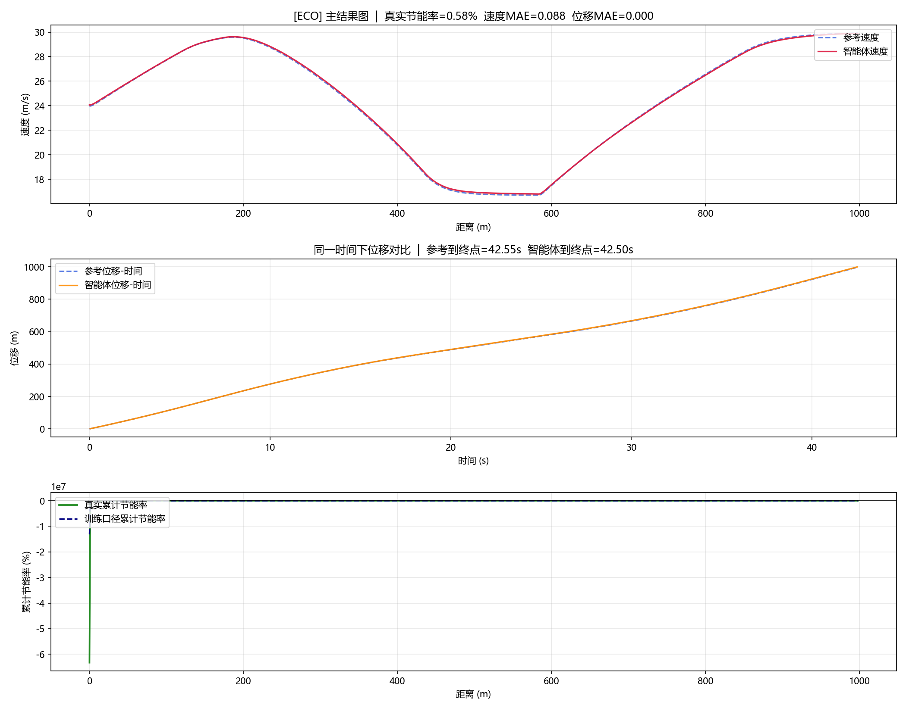
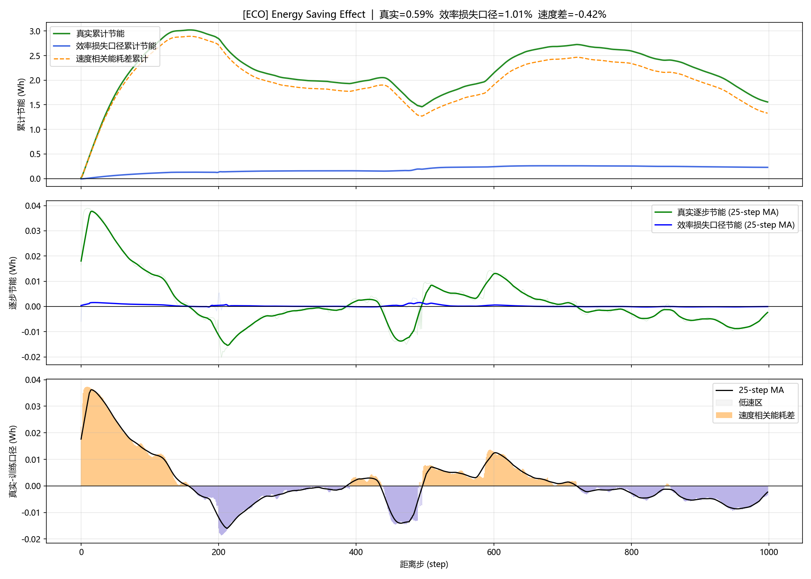
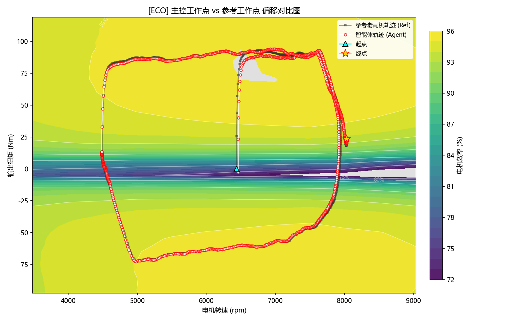
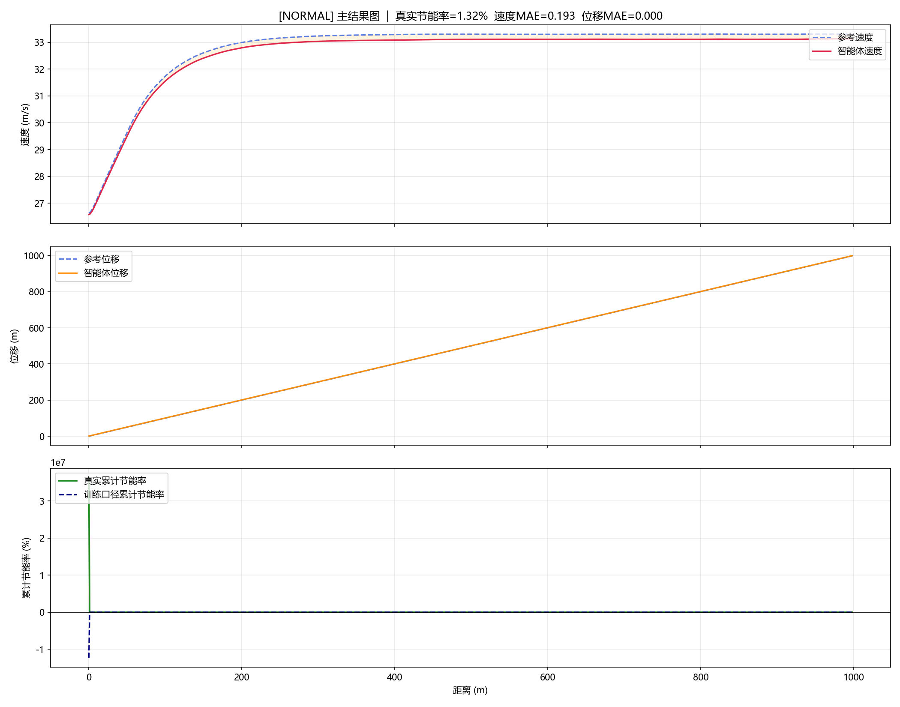
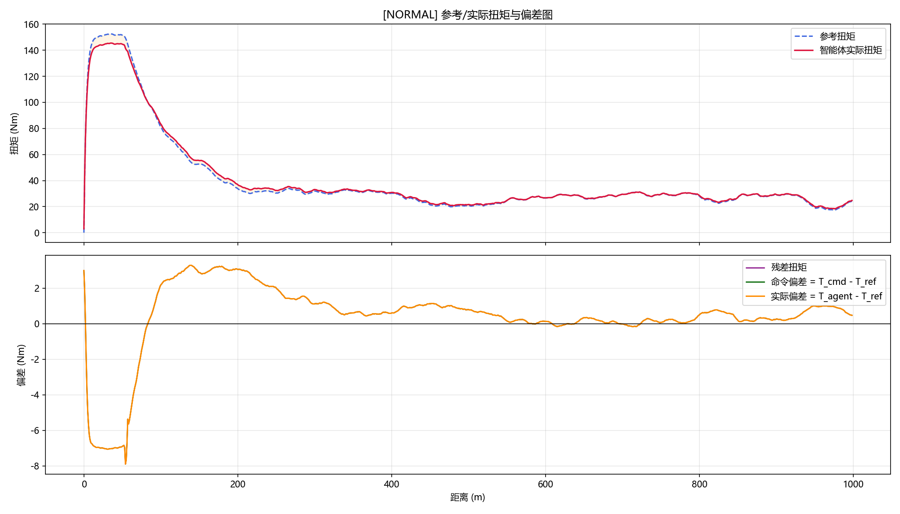
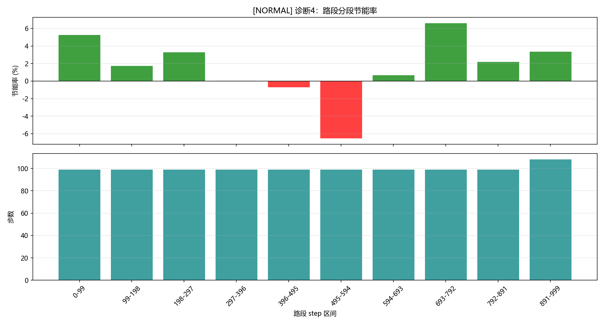
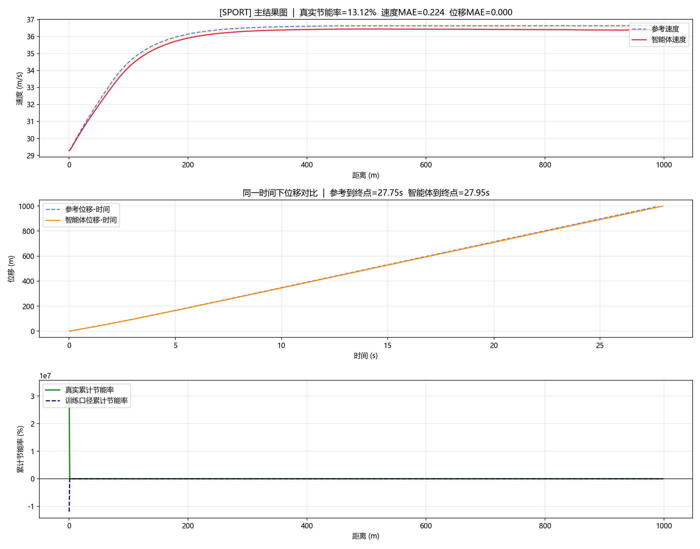
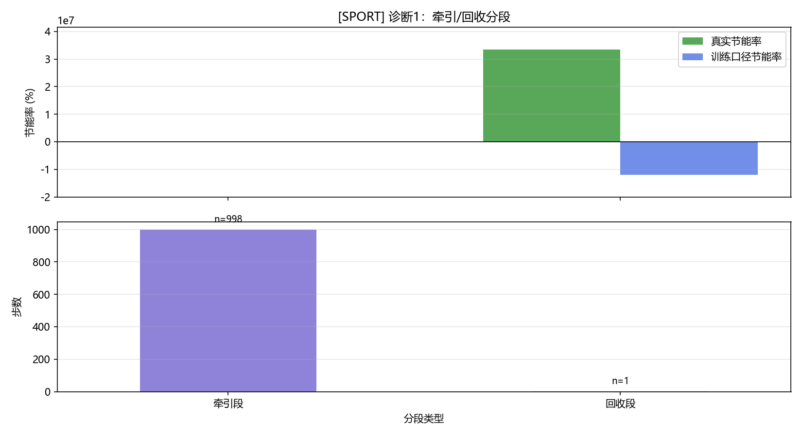
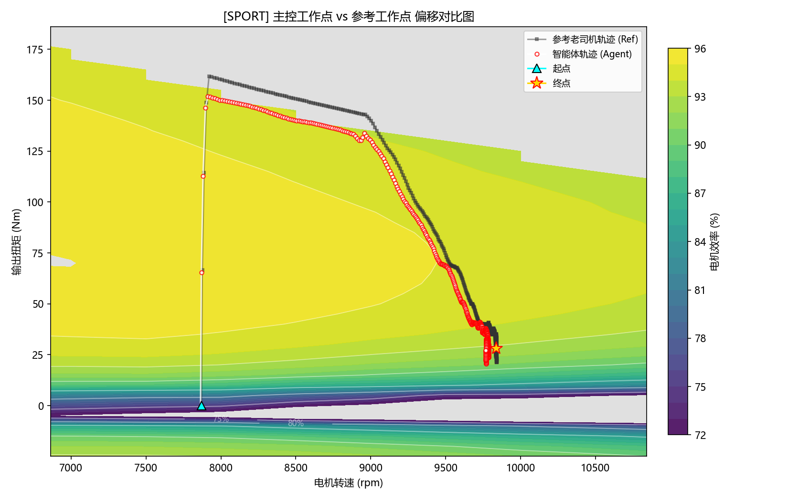

# 基于参考轨迹与强化学习的电动车风格化节能控制总结报告

## 1. 项目概述

本项目面向电动车节能控制任务，构建了一套“参考驾驶员轨迹 + 强化学习残差控制”的节能优化框架。系统先生成参考速度与参考扭矩轨迹，再由智能体在参考扭矩附近做小范围优化，在尽量保持驾驶行为自然、平顺和按时到达的前提下，实现能耗下降。

当前系统已经形成三种可解释的风格化策略：

- `eco`：稳健节能型
- `normal`：均衡型
- `sport`：高性能节能型

三种风格在统一平台上训练与评估，只在风格参数、约束容差和终局权重上做差异化设计。

---

## 2. 方法亮点与创新点

### 2.1 参考轨迹 + 残差强化学习

系统没有直接让强化学习从零控制整车，而是采用“参考轨迹 + 残差扭矩”的结构：

- 参考驾驶员提供可解释的基础驾驶行为
- 智能体只负责在参考动作附近做节能优化
- 通过纵向动力学与电机效率图计算真实车辆响应和能耗

这种结构兼顾了：

- 可解释性
- 训练稳定性
- 工程可落地性

### 2.2 奖励与约束双通道优化

系统不是只优化一个 reward，而是同时考虑：

- 节能主目标
- 速度/位移/加速度跟踪
- 平顺性
- 窗口能耗
- 投影与偏差保护

训练阶段通过拉格朗日乘子自适应调节约束强度，使模型在追求节能时不会轻易走向“慢开省电”或“虚假节能”。

### 2.3 风格化节能控制

项目不是只训练一个统一策略，而是输出三类不同取向的控制器：

- `eco` 更强调稳健与可信节能
- `normal` 更强调节能与驾驶品质平衡
- `sport` 更强调高性能条件下的节能潜力

这一点使方案在比赛展示时更有层次，也更能体现方法的泛化能力与可定制性。

### 2.4 多指标联合评估，避免“虚假节能”

系统不仅看真实电池节能率，还联合评估：

- 训练口径节能率
- 等时节能率
- 窗口节能率
- 工作点分布
- 跟踪误差

这样可以区分：

- 真实有效的效率提升
- 仅靠降速、拖时长带来的表面节能

---

## 3. 实验设置

### 3.1 三套路况

系统为每个实验生成三套路况：

- `train_road`：训练路
- `eval_road`：标准测试路
- `stress_road`：压力测试路

其中：

- `eval` 用于衡量正常路况下的表现
- `stress` 用于放大复杂工况下的稳定性与泛化问题

底层道路由随机坡度、弯道限速、城区低速段与近停车/再起步段组成。

### 3.2 当前主结果目录

当前主结果位于：

- `results/eco/seed_42`
- `results/normal/seed_42`
- `results/sport/seed_42`

总汇总文件位于：

- `results/experiment_summary.json`

---

## 4. 当前主结果总览

### 4.1 关键指标汇总

| 风格 | Eval真实节能率 | Eval速度MAE | Eval跟踪 | Stress真实节能率 | Stress跟踪 |
|---|---:|---:|---|---:|---|
| eco | +0.59% | 0.058 m/s | true | +16.95% | true |
| normal | +4.84% | 0.234 m/s | true | +8.85% | true |
| sport | +23.26% | 0.118 m/s | true | +26.93% | true |

数据来源：

- [eco metrics](results/eco/seed_42/metrics.json)
- [normal metrics](results/normal/seed_42/metrics.json)
- [sport metrics](results/sport/seed_42/metrics.json)

从当前结果看，三种风格都已经实现了：

- 标准工况真实正节能
- 压力工况真实正节能
- 标准与压力工况跟踪约束满足

这意味着当前版本已经不仅能“看起来节能”，而且整体结果已经具备较好的展示价值与可信度。

---

## 5. 各风格结果分析

### 5.1 Eco：稳健可信的节能基线

`eco` 模式是当前最稳、最适合做工程基线的一条线。

其特点是：

- 标准路况下保持正节能
- 压力路况下节能仍然明显
- 跟踪误差小，结果可信度高

它最适合在比赛里承担“稳定、可靠、可解释”的角色。

#### 图 1 Eco 主结果图

#### 图 2 Eco 节能效果图

#### 图 3 Eco 工作点分布图

---

### 5.2 Normal：最均衡、最接近默认落地方案

`normal` 模式是当前最适合作为“默认策略”展示的一条线。

当前结果为：

- 标准工况真实节能 `4.84%`
- 压力工况真实节能 `8.85%`
- `eval/stress` 跟踪均通过

这说明该策略已经不仅在普通路况中有效，而且在更复杂路况中也保持了较好的节能与跟踪平衡。

相比 `eco`，它节能更积极；相比 `sport`，它又更接近实际应用所需的平衡风格。

#### 图 4 Normal 主结果图

#### 图 5 Normal 实际扭矩偏差图

#### 图 6 Normal 路段分段诊断图

---

### 5.3 Sport：高性能节能上限方案

`sport` 模式是当前最适合展示“高性能节能上限”的一条线。

当前结果为：

- 标准工况真实节能 `23.26%`
- 压力工况真实节能 `26.93%`
- 标准与压力工况跟踪均通过

这说明在收紧容差和终局约束后，`sport` 已经从早期“虚高节能”的状态修正为当前更可信的高性能版本。

它最适合在比赛里展示“方法上限”和“不同风格可配置能力”。

#### 图 7 Sport 主结果图

#### 图 8 Sport 牵引/回收分段图

#### 图 9 Sport 工作点分布图

---

## 6. 当前结果总体评价

综合来看，当前版本已经达到以下几个关键成果：

1. 成功训练出三种可解释、可区分的风格化节能控制器。
2. 三种风格在 `eval` 和 `stress` 下均实现真实正节能。
3. 当前主目录结果中，三种风格在 `eval` 与 `stress` 下均满足跟踪要求。
4. 图像、指标、工作点诊断与节能分析已经可以形成完整展示闭环。

因此，从比赛展示角度看，这已经是一个**可交付、可展示、可解释**的较成熟版本。

---

## 7. 当前不足与后续空间

虽然当前结果整体已经较好，但仍有两个值得诚实说明的点：

### 7.1 主动增大扭矩来节能的问题还未完全解决

当前智能体已经学会稳定节能，但更多还是通过：

- 减少不必要扭矩
- 改善工作点
- 保持更平顺的控制

来实现节能。

它还没有非常稳定地学会：

- 在某些特定路段主动增大扭矩
- 将工作点推入高效率区域
- 从而获得更优的全局节能

这仍然是后续值得继续优化的方向。

### 7.2 鲁棒性增强仍有继续研究空间

虽然当前 `stress` 已经可用，但我们在若干增强实验中发现：

- 单纯增加训练路复杂性
- 单纯加入轻量扰动
- 或仅增加某些物理输入

都不一定自动提升泛化，反而可能引发“更稳跟踪但更差节能”或者“虚高节能”。

因此，后续更合理的方向是：

- 更细致地设计训练分布
- 强化模型选择中的鲁棒性指标
- 继续优化“何时该主动补扭矩”的行为学习

---

## 8. 可直接用于比赛答辩的总结表述

本项目提出了一种基于参考驾驶员轨迹与强化学习残差控制的电动车节能优化方法。该方法在统一道路平台上实现了 `eco / normal / sport` 三种风格化节能控制策略，并通过真实电池能耗、等时节能率、窗口节能率与工作点分布等多指标联合评估，保证了结果的真实性与可解释性。

实验结果表明：

- `eco` 模式提供了稳健、可信的节能基线；
- `normal` 模式在保持良好驾驶品质的前提下，实现了较好的综合节能效果；
- `sport` 模式则展示了在高性能约束下依然具备显著节能潜力的上限表现。

整体来看，本方案已经证明：在统一道路和参考驾驶条件下，强化学习能够学习到具有解释性、风格化和展示价值的电动车节能控制策略，具备较强的竞赛展示与进一步工程优化潜力。
